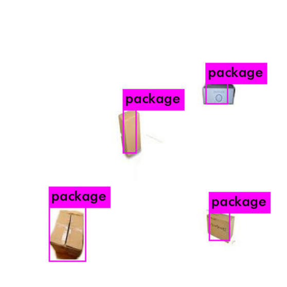

# tensorflow-yolov4-tflite
[](LICENSE)

YOLOv4, YOLOv4-tiny Implemented in Tensorflow 2.0. 

### Prerequisites
* Tensorflow 2.3.0rc0
* Roboflow account
* Google Colab 

### What it's about
Here you got a google colab notebook, where you can train your one Computer Vision Model!
```bash
```
# How so?
## yolov4
Just go to: https://colab.research.google.com/drive/1fPN1f5PDwLPkIXGiyWHKyvBOc1LbezHh?usp=sharing
Clone the notebook, and follow the steps!

#The dataset
#### Here we used a private dataset, it's for a package detection model 
###You can use a public dataset from Roboflow, checkout here: Roboflow(https://public.roboflow.com/)

# Output

##### Yolov4 tiny weight
<p align="center"></p>
### Convert to tflite

```bash


### TODO
* [x] Convert YOLOv4 to TensorRT
* [x] YOLOv4 tflite on android
* [ ] YOLOv4 tflite on ios
* [x] Training code
* [x] Update scale xy
* [ ] ciou
* [ ] Mosaic data augmentation
* [x] Mish activation
* [x] yolov4 tflite version
* [x] yolov4 in8 tflite version for mobile

### References

  * YOLOv4: Optimal Speed and Accuracy of Object Detection [YOLOv4](https://arxiv.org/abs/2004.10934).
  * [darknet](https://github.com/AlexeyAB/darknet)
  
   My project is inspired by these previous fantastic YOLOv3 implementations:
  * [Yolov3 tensorflow](https://github.com/YunYang1994/tensorflow-yolov3)
  * [Yolov3 tf2](https://github.com/zzh8829/yolov3-tf2)
